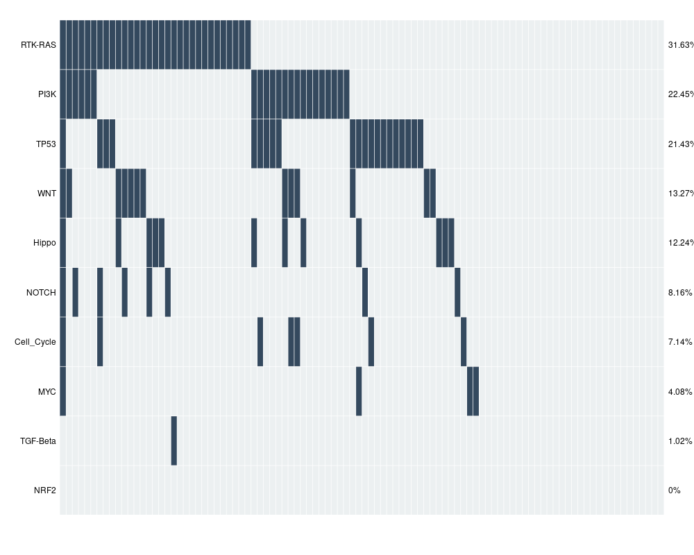

```{r setup, include=FALSE}

knitr::opts_chunk$set(echo = FALSE, message = F, warning = F)
library(dplyr)
library(readr)
library(stringr)
library(ggplot2)
library(patchwork)
library(knitr)
library(kableExtra)
library(ComplexHeatmap)
library(BiocManager)
library(maftools)
library(GenVisR)

```

========================================================

# Exploring Mutations in Glioblastoma 

## Using CPTAC Glioblastoma dataset

------------------------------------------------------------------------

In this project, I analyse the mutational profile of Glioblastoma cancer.

The data set used for this project is the CPTAC Glioblastoma cohort.

The files from <https://www.linkedomics.org/data_download/CPTAC-GBM/> are cleaned before using for analysis.

```{r dataset, echo=FALSE}
# Clinical
sampInfo <- read.csv("derived_data/sampInfo.csv")
GBM_meta <- read.csv("derived_data/GBM_metainfo.csv")

#Mutation
mutations<- read.delim("source_data/somatic_mutations.maf.gz")
mutations$Variant_Classification <- ifelse( mutations$Variant_Classification=="Splice_Region", "Splice_Site",mutations$Variant_Classification)

mafObj<-read.maf("source_data/somatic_mutations.maf.gz")

#Genome
genome <- read.delim2("source_data/CPTAC_GBM_rnaseq_fpkm_uq_log2.txt")
rownames(genome)<-genome[,1]
genome<-genome[,-1]
genome<-as.data.frame(genome)
```

------------------------------------------------------------------------

## Demographics

The data set contains information from 99 men and women aged 24 to 88, with a median age of 59. The patients are from various countries of origin, with around 30 from China, 21 from United States, 19 from Russia and 18 from Poland.

It is interesting to note that approximately 73% of the cohort were non-smokers (62 patients). Previous studies also indicate smoking status is not a marker for glioblastoma.

{style="align: center" width="80%"}

------------------------------------------------------------------------

## Mutational Profile

The meta data contains information about the mutations in genes ATRX, PIK3CA, RB1, TP53, EGFR and PTEN.

It is observed that TP53 and PTEN are mutated in most samples.

{alt="Gene Counts" align="center" width="50%"}

Around 45 % of the cohort had only one mutation and 22% did not have any mutation. Only 1 patient had mutation in 4 genes.

```{r mutCount}

# Subset the GBM data frame to rows 10 to 17 to choose only mutation columns
subset_data <- GBM_meta[,12:17]
subset_data <- subset_data %>% mutate_all(as.numeric)

# Calculating the sum of each column in the subset
row_sums <-rowSums(subset_data)

sum_table <- as.data.frame(table(row_sums))

# Rename the columns
colnames(sum_table) <- c("No.of.Mutations", "Freq")

# Calculating the sum of each column in the subset
col_sums <-colSums(subset_data)

col_sums<-as.data.frame(col_sums)
col_sums$genes <- rownames(col_sums)
rownames(col_sums)<-NULL
colnames(col_sums)<-c("Freq","Genes")
col_sums<-col_sums[,c("Genes","Freq")]
col_sums$Genes <- gsub("_mutation", "", col_sums$Genes)

kable(col_sums, format = "html", align = 'c', caption = "Number of Mutations in Genes") %>%
  kable_styling(full_width = FALSE, position = "center")

kable(sum_table, format = "html", align = 'c', caption = "Frequency of mutations") %>%
  kable_styling(full_width = FALSE, position = "center")

```

I will be focusing only on the genes ATRX, PIK3CA, RB1, TP53, EGFR and PTEN for further analysis. Only 69 samples have mutations in these genes.

```{r mutSubset}
genes <- c("ATRX", "PIK3CA", "RB1", "TP53", "EGFR", "PTEN")
idx1<-which(mutations$Hugo_Symbol %in% genes)
mutation_subset <- mutations[idx1,]

```

Looking at the mutations by variant type, we see that EGFR has the highest number of SNPs followed by ATRX. It is observed that most of the mutations are SNPs and there are few Indels.

```{r mutTally1}
mutation_subset %>% 
  group_by(Hugo_Symbol, Variant_Type) %>% 
  tally()  %>%
   arrange(desc(n), Variant_Type) 
```

Variant Classification

Mutations could be in different regions of the gene. Depending on the location of mutation, it could either impact gene regulation or protein expression. EGFR has most mutations in Intronic region and missense mutations. Missense mutations result in change in codons and thus a change in protein structure.

```{r mutTally2}
mutation_subset %>%
  group_by(Hugo_Symbol, Variant_Classification) %>%
  tally() %>%
   arrange(desc(n), Hugo_Symbol)
```

{align="center"}

The package GenVisR is useful for visualizing mutation data. All the mutations in the subset of data are non-synonymous mutations. EGFR is mutated in most samples and most samples have mutations in introns.

{align="center"}

Using the maftools package, we can look at which pathways are affected the most due to mutations in the cohort.

The RTK-RAS signaling pathway accounts for 30% of the mutation, followed by PI3K pathway, which is in line with the mutations counts since EGFR, PI3K and PTEN play a role in these pathways.

{width="80%"}

------------------------------------------------------------------------

## Genomic Profile

The gene expression data available is log2 transformed fpkm. No specific cluster is observed in the gene expression.

If tpkm data was available, we can use it for differential expression analysis and Gene set enrichment.

```{r, eval=FALSE}

# Heatmap
genome <- as.data.frame(sapply(genome, as.numeric))

# Create a Heatmap object
heatmap_obj <- Heatmap(genome, 
                       name = "Genomic Data", 
                       row_names_gp = gpar(fontsize = 8), 
                       column_names_gp = gpar(fontsize = 8))

# Draw the heatmap
draw(heatmap_obj)

```

## Conclusion

The National Cancer Institute's Clinical Proteomic Tumor Analysis Consortium (CPTAC) contains comprehensive data for various tumors. However, the Glioblastoma data set contains limited clinical information. Also, the existing RNAseq data needs to be processed further to use it for gene expression analysis.
